# Member Management System - Mermaid Diagrams

This document contains comprehensive Mermaid diagrams for the ICT711 Assessment 4 Member Management System, providing visual representations of the system architecture, class relationships, data flows, and algorithm processes.

## Table of Contents

1. [Class Diagrams](#class-diagrams)
2. [System Architecture](#system-architecture)
3. [Sequence Diagrams](#sequence-diagrams)
4. [Flowcharts](#flowcharts)
5. [State Diagrams](#state-diagrams)
6. [Entity Relationship Diagrams](#entity-relationship-diagrams)

---

## Class Diagrams

### Core Entity Class Diagram

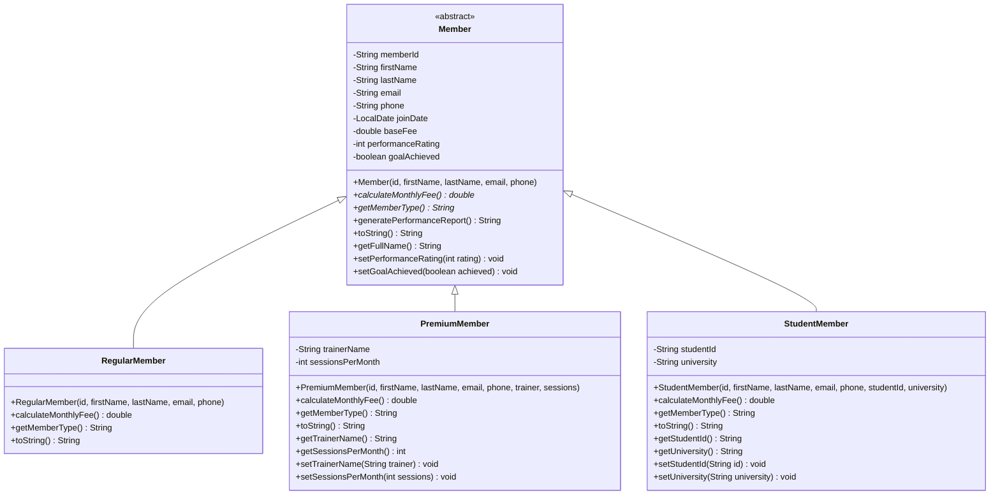
```mermaid
classDiagram
    class Member {
        <<abstract>>
        -String memberId
        -String firstName
        -String lastName
        -String email
        -String phone
        -LocalDate joinDate
        -double baseFee
        -int performanceRating
        -boolean goalAchieved
        +Member(id, firstName, lastName, email, phone)
        +calculateMonthlyFee()* double
        +getMemberType()* String
        +generatePerformanceReport() String
        +toString() String
        +getFullName() String
        +setPerformanceRating(int rating) void
        +setGoalAchieved(boolean achieved) void
    }

    class RegularMember {
        +RegularMember(id, firstName, lastName, email, phone)
        +calculateMonthlyFee() double
        +getMemberType() String
        +toString() String
    }

    class PremiumMember {
        -String trainerName
        -int sessionsPerMonth
        +PremiumMember(id, firstName, lastName, email, phone, trainer, sessions)
        +calculateMonthlyFee() double
        +getMemberType() String
        +toString() String
        +getTrainerName() String
        +getSessionsPerMonth() int
        +setTrainerName(String trainer) void
        +setSessionsPerMonth(int sessions) void
    }

    class StudentMember {
        -String studentId
        -String university
        +StudentMember(id, firstName, lastName, email, phone, studentId, university)
        +calculateMonthlyFee() double
        +getMemberType() String
        +toString() String
        +getStudentId() String
        +getUniversity() String
        +setStudentId(String id) void
        +setUniversity(String university) void
    }

    Member <|-- RegularMember
    Member <|-- PremiumMember
    Member <|-- StudentMember
```

### Business Logic Class Diagram

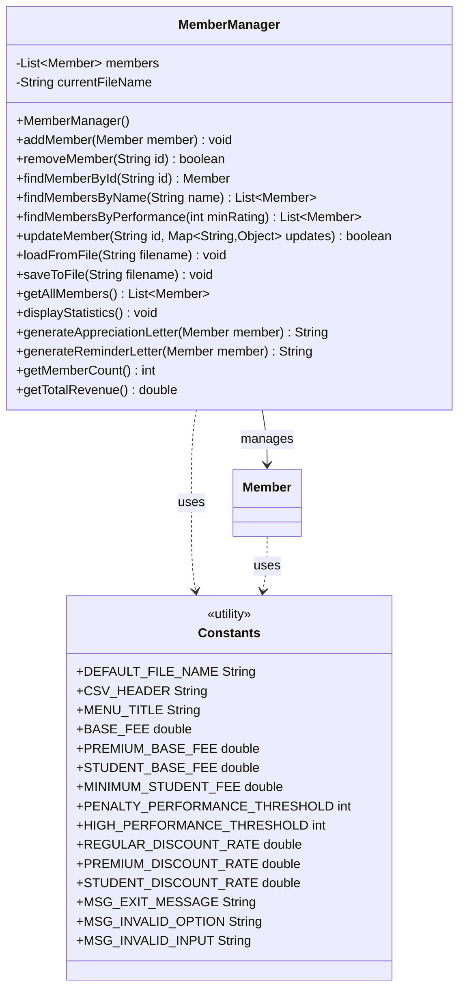
```mermaid
classDiagram
    class MemberManager {
        -List~Member~ members
        -String currentFileName
        +MemberManager()
        +addMember(Member member) void
        +removeMember(String id) boolean
        +findMemberById(String id) Member
        +findMembersByName(String name) List~Member~
        +findMembersByPerformance(int minRating) List~Member~
        +updateMember(String id, Map~String,Object~ updates) boolean
        +loadFromFile(String filename) void
        +saveToFile(String filename) void
        +getAllMembers() List~Member~
        +displayStatistics() void
        +generateAppreciationLetter(Member member) String
        +generateReminderLetter(Member member) String
        +getMemberCount() int
        +getTotalRevenue() double
    }

    class Constants {
        <<utility>>
        +DEFAULT_FILE_NAME String
        +CSV_HEADER String
        +MENU_TITLE String
        +BASE_FEE double
        +PREMIUM_BASE_FEE double
        +STUDENT_BASE_FEE double
        +MINIMUM_STUDENT_FEE double
        +PENALTY_PERFORMANCE_THRESHOLD int
        +HIGH_PERFORMANCE_THRESHOLD int
        +REGULAR_DISCOUNT_RATE double
        +PREMIUM_DISCOUNT_RATE double
        +STUDENT_DISCOUNT_RATE double
        +MSG_EXIT_MESSAGE String
        +MSG_INVALID_OPTION String
        +MSG_INVALID_INPUT String
    }

    MemberManager --> Member : manages
    MemberManager ..> Constants : uses
    Member ..> Constants : uses
```

### Algorithm Classes Diagram

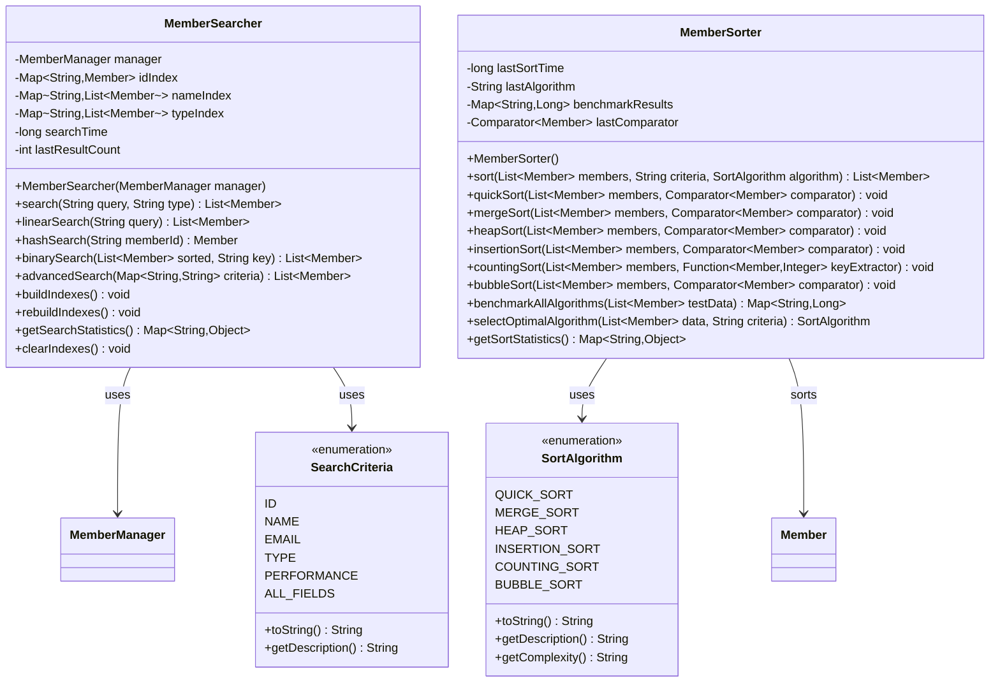
```mermaid
classDiagram
    class MemberSearcher {
        -MemberManager manager
        -Map~String,Member~ idIndex
        -Map~String,List~Member~~ nameIndex
        -Map~String,List~Member~~ typeIndex
        -long searchTime
        -int lastResultCount
        +MemberSearcher(MemberManager manager)
        +search(String query, String type) List~Member~
        +linearSearch(String query) List~Member~
        +hashSearch(String memberId) Member
        +binarySearch(List~Member~ sorted, String key) List~Member~
        +advancedSearch(Map~String,String~ criteria) List~Member~
        +buildIndexes() void
        +rebuildIndexes() void
        +getSearchStatistics() Map~String,Object~
        +clearIndexes() void
    }

    class MemberSorter {
        -long lastSortTime
        -String lastAlgorithm
        -Map~String,Long~ benchmarkResults
        -Comparator~Member~ lastComparator
        +MemberSorter()
        +sort(List~Member~ members, String criteria, SortAlgorithm algorithm) List~Member~
        +quickSort(List~Member~ members, Comparator~Member~ comparator) void
        +mergeSort(List~Member~ members, Comparator~Member~ comparator) void
        +heapSort(List~Member~ members, Comparator~Member~ comparator) void
        +insertionSort(List~Member~ members, Comparator~Member~ comparator) void
        +countingSort(List~Member~ members, Function~Member,Integer~ keyExtractor) void
        +bubbleSort(List~Member~ members, Comparator~Member~ comparator) void
        +benchmarkAllAlgorithms(List~Member~ testData) Map~String,Long~
        +selectOptimalAlgorithm(List~Member~ data, String criteria) SortAlgorithm
        +getSortStatistics() Map~String,Object~
    }

    class SortAlgorithm {
        <<enumeration>>
        QUICK_SORT
        MERGE_SORT
        HEAP_SORT
        INSERTION_SORT
        COUNTING_SORT
        BUBBLE_SORT
        +toString() String
        +getDescription() String
        +getComplexity() String
    }

    class SearchCriteria {
        <<enumeration>>
        ID
        NAME
        EMAIL
        TYPE
        PERFORMANCE
        ALL_FIELDS
        +toString() String
        +getDescription() String
    }

    MemberSearcher --> MemberManager : uses
    MemberSearcher --> SearchCriteria : uses
    MemberSorter --> SortAlgorithm : uses
    MemberSorter --> Member : sorts
```

### GUI Classes Diagram

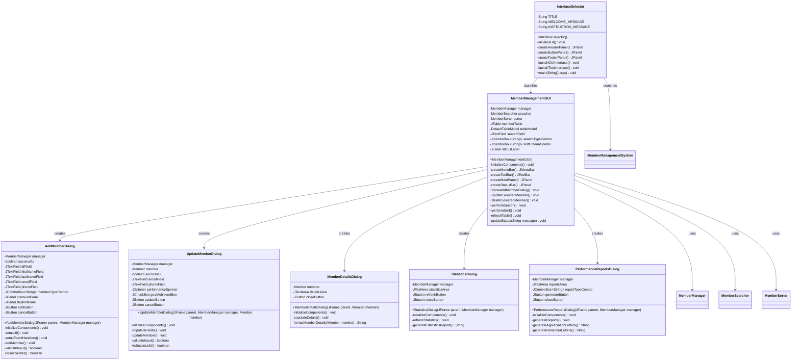
```mermaid
classDiagram
    class InterfaceSelector {
        -String TITLE
        -String WELCOME_MESSAGE
        -String INSTRUCTION_MESSAGE
        +InterfaceSelector()
        -initializeUI() void
        -createHeaderPanel() JPanel
        -createButtonPanel() JPanel
        -createFooterPanel() JPanel
        -launchGUIInterface() void
        -launchTextInterface() void
        +main(String[] args) void
    }

    class MemberManagementGUI {
        -MemberManager manager
        -MemberSearcher searcher
        -MemberSorter sorter
        -JTable memberTable
        -DefaultTableModel tableModel
        -JTextField searchField
        -JComboBox~String~ searchTypeCombo
        -JComboBox~String~ sortCriteriaCombo
        -JLabel statusLabel
        +MemberManagementGUI()
        -initializeComponents() void
        -createMenuBar() JMenuBar
        -createToolBar() JToolBar
        -createMainPanel() JPanel
        -createStatusBar() JPanel
        +showAddMemberDialog() void
        +updateSelectedMember() void
        +deleteSelectedMember() void
        +performSearch() void
        +performSort() void
        -refreshTable() void
        -updateStatus(String message) void
    }

    class AddMemberDialog {
        -MemberManager manager
        -boolean successful
        -JTextField idField
        -JTextField firstNameField
        -JTextField lastNameField
        -JTextField emailField
        -JTextField phoneField
        -JComboBox~String~ memberTypeCombo
        -JPanel premiumPanel
        -JPanel studentPanel
        -JButton addButton
        -JButton cancelButton
        +AddMemberDialog(JFrame parent, MemberManager manager)
        -initializeComponents() void
        -setupUI() void
        -setupEventHandlers() void
        -addMember() void
        -validateInput() boolean
        +isSuccessful() boolean
    }

    class UpdateMemberDialog {
        -MemberManager manager
        -Member member
        -boolean successful
        -JTextField emailField
        -JTextField phoneField
        -JSpinner performanceSpinner
        -JCheckBox goalAchievedBox
        -JButton updateButton
        -JButton cancelButton
        +UpdateMemberDialog(JFrame parent, MemberManager manager, Member member)
        -initializeComponents() void
        -populateFields() void
        -updateMember() void
        -validateInput() boolean
        +isSuccessful() boolean
    }

    class MemberDetailsDialog {
        -Member member
        -JTextArea detailsArea
        -JButton closeButton
        +MemberDetailsDialog(JFrame parent, Member member)
        -initializeComponents() void
        -populateDetails() void
        -formatMemberDetails(Member member) String
    }

    class StatisticsDialog {
        -MemberManager manager
        -JTextArea statisticsArea
        -JButton refreshButton
        -JButton closeButton
        +StatisticsDialog(JFrame parent, MemberManager manager)
        -initializeComponents() void
        -refreshStatistics() void
        -generateStatisticsReport() String
    }

    class PerformanceReportsDialog {
        -MemberManager manager
        -JTextArea reportsArea
        -JComboBox~String~ reportTypeCombo
        -JButton generateButton
        -JButton closeButton
        +PerformanceReportsDialog(JFrame parent, MemberManager manager)
        -initializeComponents() void
        -generateReports() void
        -generateAppreciationLetters() String
        -generateReminderLetters() String
    }

    InterfaceSelector --> MemberManagementGUI : launches
    InterfaceSelector --> MemberManagementSystem : launches
    MemberManagementGUI --> AddMemberDialog : creates
    MemberManagementGUI --> UpdateMemberDialog : creates
    MemberManagementGUI --> MemberDetailsDialog : creates
    MemberManagementGUI --> StatisticsDialog : creates
    MemberManagementGUI --> PerformanceReportsDialog : creates
    MemberManagementGUI --> MemberManager : uses
    MemberManagementGUI --> MemberSearcher : uses
    MemberManagementGUI --> MemberSorter : uses
```

---

## System Architecture

### Overall System Architecture

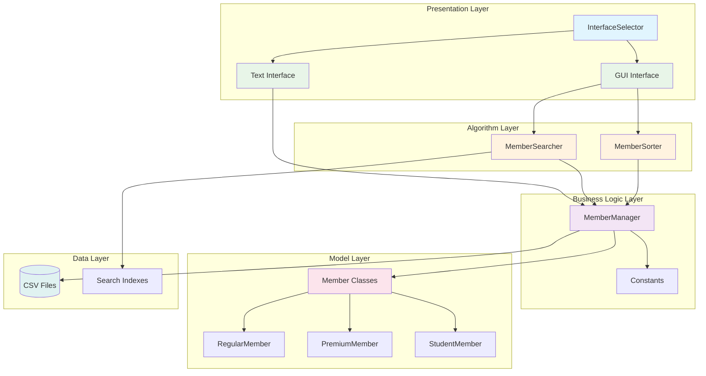
```mermaid
graph TB
    subgraph "Presentation Layer"
        IS[InterfaceSelector]
        GUI[GUI Interface]
        TUI[Text Interface]
    end
    
    subgraph "Algorithm Layer"
        SEARCH[MemberSearcher]
        SORT[MemberSorter]
    end
    
    subgraph "Business Logic Layer"
        MGR[MemberManager]
        CONST[Constants]
    end
    
    subgraph "Model Layer"
        MEMBER[Member Classes]
        REG[RegularMember]
        PREM[PremiumMember]
        STU[StudentMember]
    end
    
    subgraph "Data Layer"
        CSV[(CSV Files)]
        INDEX[Search Indexes]
    end
    
    IS --> GUI
    IS --> TUI
    GUI --> SEARCH
    GUI --> SORT
    TUI --> MGR
    SEARCH --> MGR
    SORT --> MGR
    MGR --> MEMBER
    MGR --> CONST
    MEMBER --> REG
    MEMBER --> PREM
    MEMBER --> STU
    MGR --> CSV
    SEARCH --> INDEX
    
    style IS fill:#e1f5fe
    style GUI fill:#e8f5e8
    style TUI fill:#e8f5e8
    style SEARCH fill:#fff3e0
    style SORT fill:#fff3e0
    style MGR fill:#f3e5f5
    style MEMBER fill:#fce4ec
    style CSV fill:#e0f2f1
```

### MVC Pattern Implementation

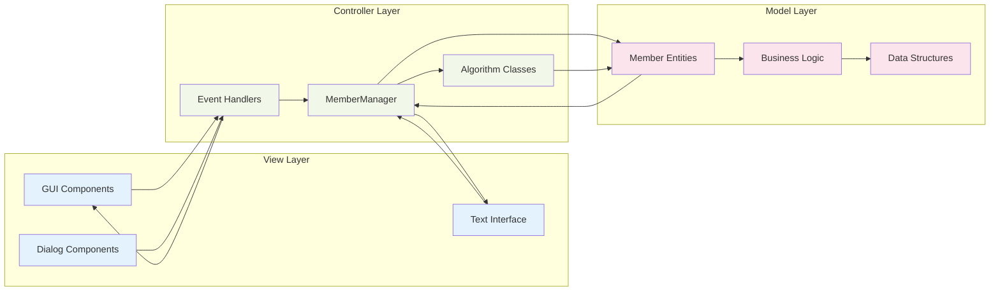
```mermaid
graph LR
    subgraph "View Layer"
        V1[GUI Components]
        V2[Dialog Components]
        V3[Text Interface]
    end
    
    subgraph "Controller Layer"
        C1[Event Handlers]
        C2[MemberManager]
        C3[Algorithm Classes]
    end
    
    subgraph "Model Layer"
        M1[Member Entities]
        M2[Business Logic]
        M3[Data Structures]
    end
    
    V1 --> C1
    V2 --> C1
    V3 --> C2
    C1 --> C2
    C2 --> C3
    C2 --> M1
    C3 --> M1
    M1 --> M2
    M2 --> M3
    
    C1 --> V1
    C2 --> V3
    M1 --> C2
    
    style V1 fill:#e3f2fd
    style V2 fill:#e3f2fd
    style V3 fill:#e3f2fd
    style C1 fill:#f1f8e9
    style C2 fill:#f1f8e9
    style C3 fill:#f1f8e9
    style M1 fill:#fce4ec
    style M2 fill:#fce4ec
    style M3 fill:#fce4ec
```

---

## Sequence Diagrams

### Add Member Sequence

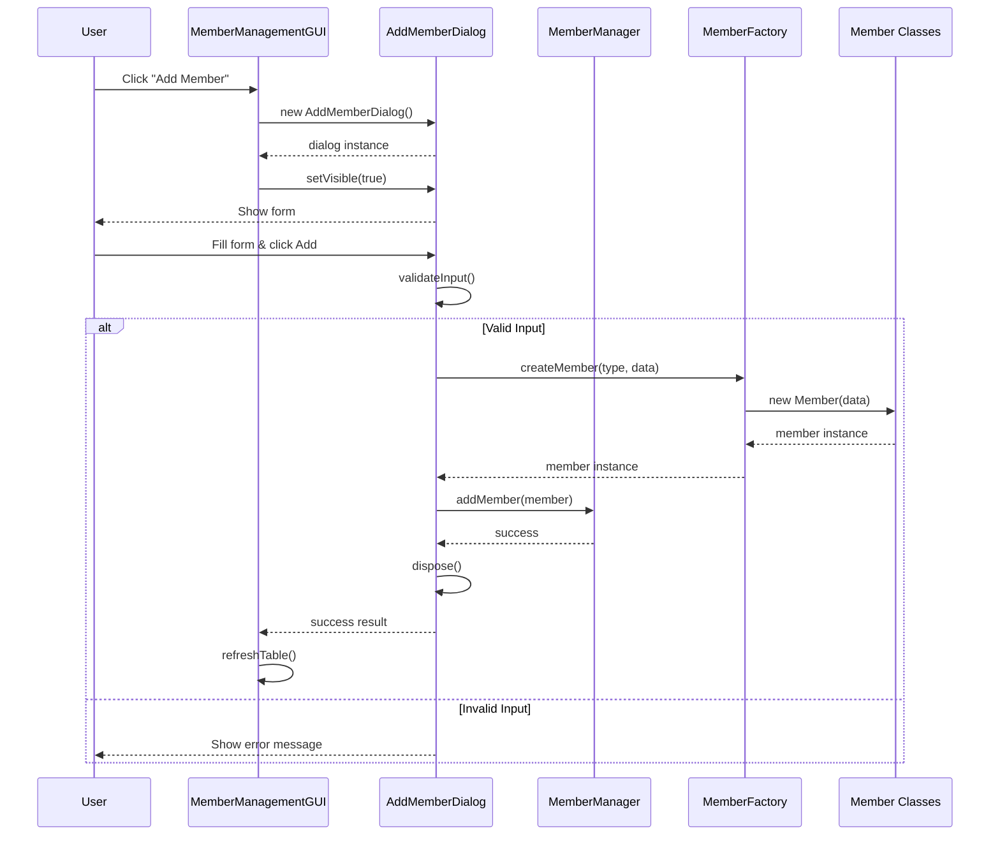
```mermaid
sequenceDiagram
    participant User
    participant GUI as MemberManagementGUI
    participant Dialog as AddMemberDialog
    participant Manager as MemberManager
    participant Factory as MemberFactory
    participant Member as Member Classes
    
    User->>GUI: Click "Add Member"
    GUI->>Dialog: new AddMemberDialog()
    Dialog-->>GUI: dialog instance
    GUI->>Dialog: setVisible(true)
    Dialog-->>User: Show form
    
    User->>Dialog: Fill form & click Add
    Dialog->>Dialog: validateInput()
    alt Valid Input
        Dialog->>Factory: createMember(type, data)
        Factory->>Member: new Member(data)
        Member-->>Factory: member instance
        Factory-->>Dialog: member instance
        Dialog->>Manager: addMember(member)
        Manager-->>Dialog: success
        Dialog->>Dialog: dispose()
        Dialog-->>GUI: success result
        GUI->>GUI: refreshTable()
    else Invalid Input
        Dialog-->>User: Show error message
    end
```

### Search Operation Sequence

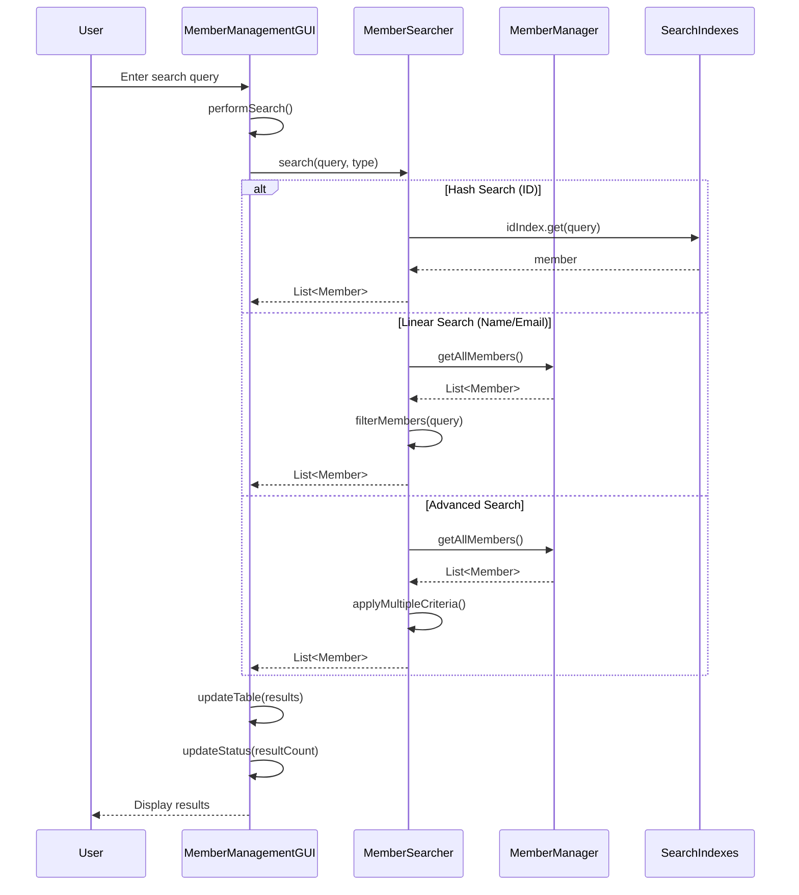
```mermaid
sequenceDiagram
    participant User
    participant GUI as MemberManagementGUI
    participant Searcher as MemberSearcher
    participant Manager as MemberManager
    participant Index as SearchIndexes
    
    User->>GUI: Enter search query
    GUI->>GUI: performSearch()
    GUI->>Searcher: search(query, type)
    
    alt Hash Search (ID)
        Searcher->>Index: idIndex.get(query)
        Index-->>Searcher: member
        Searcher-->>GUI: List<Member>
    else Linear Search (Name/Email)
        Searcher->>Manager: getAllMembers()
        Manager-->>Searcher: List<Member>
        Searcher->>Searcher: filterMembers(query)
        Searcher-->>GUI: List<Member>
    else Advanced Search
        Searcher->>Manager: getAllMembers()
        Manager-->>Searcher: List<Member>
        Searcher->>Searcher: applyMultipleCriteria()
        Searcher-->>GUI: List<Member>
    end
    
    GUI->>GUI: updateTable(results)
    GUI->>GUI: updateStatus(resultCount)
    GUI-->>User: Display results
```

### Sort Operation Sequence

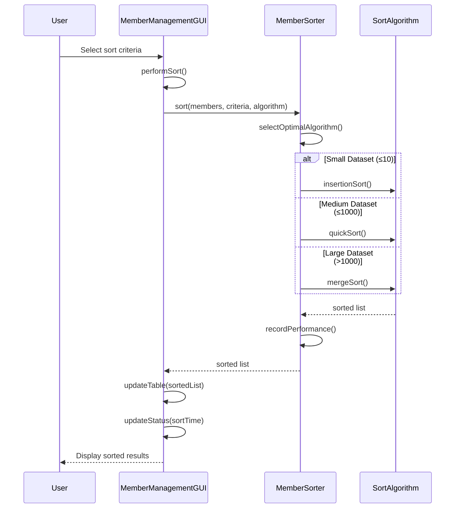
```mermaid
sequenceDiagram
    participant User
    participant GUI as MemberManagementGUI
    participant Sorter as MemberSorter
    participant Algorithm as SortAlgorithm
    
    User->>GUI: Select sort criteria
    GUI->>GUI: performSort()
    GUI->>Sorter: sort(members, criteria, algorithm)
    
    Sorter->>Sorter: selectOptimalAlgorithm()
    alt Small Dataset (≤10)
        Sorter->>Algorithm: insertionSort()
    else Medium Dataset (≤1000)
        Sorter->>Algorithm: quickSort()
    else Large Dataset (>1000)
        Sorter->>Algorithm: mergeSort()
    end
    
    Algorithm-->>Sorter: sorted list
    Sorter->>Sorter: recordPerformance()
    Sorter-->>GUI: sorted list
    GUI->>GUI: updateTable(sortedList)
    GUI->>GUI: updateStatus(sortTime)
    GUI-->>User: Display sorted results
```

---

## Flowcharts

### Application Startup Flow

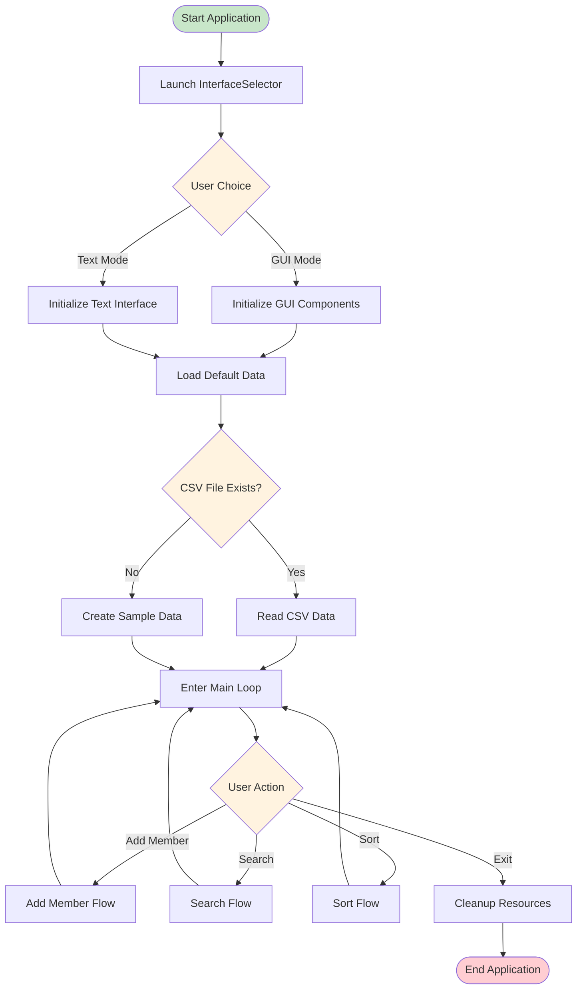
```mermaid
flowchart TD
    START([Start Application]) --> SELECTOR[Launch InterfaceSelector]
    SELECTOR --> CHOICE{User Choice}
    
    CHOICE -->|GUI Mode| INIT_GUI[Initialize GUI Components]
    CHOICE -->|Text Mode| INIT_TEXT[Initialize Text Interface]
    
    INIT_GUI --> LOAD_DATA[Load Default Data]
    INIT_TEXT --> LOAD_DATA
    
    LOAD_DATA --> CHECK_FILE{CSV File Exists?}
    CHECK_FILE -->|Yes| READ_FILE[Read CSV Data]
    CHECK_FILE -->|No| CREATE_SAMPLE[Create Sample Data]
    
    READ_FILE --> MAIN_LOOP[Enter Main Loop]
    CREATE_SAMPLE --> MAIN_LOOP
    
    MAIN_LOOP --> USER_ACTION{User Action}
    USER_ACTION -->|Add Member| ADD_FLOW[Add Member Flow]
    USER_ACTION -->|Search| SEARCH_FLOW[Search Flow]
    USER_ACTION -->|Sort| SORT_FLOW[Sort Flow]
    USER_ACTION -->|Exit| CLEANUP[Cleanup Resources]
    
    ADD_FLOW --> MAIN_LOOP
    SEARCH_FLOW --> MAIN_LOOP
    SORT_FLOW --> MAIN_LOOP
    
    CLEANUP --> END([End Application])
    
    style START fill:#c8e6c9
    style END fill:#ffcdd2
    style CHOICE fill:#fff3e0
    style CHECK_FILE fill:#fff3e0
    style USER_ACTION fill:#fff3e0
```

### Search Algorithm Selection Flow

```mermaid
flowchart TD
    START([Search Request]) --> ANALYZE[Analyze Search Criteria]
    ANALYZE --> TYPE{Search Type}
    
    TYPE -->|ID Exact Match| CHECK_INDEX{ID Index Built?}
    TYPE -->|Name Pattern| LINEAR[Linear Search]
    TYPE -->|Multiple Criteria| ADVANCED[Advanced Search]
    TYPE -->|Sorted Data| BINARY[Binary Search]
    
    CHECK_INDEX -->|Yes| HASH[Hash Search O(1)]
    CHECK_INDEX -->|No| BUILD[Build ID Index]
    BUILD --> HASH
    
    LINEAR --> EXECUTE_LINEAR[Execute Linear Search O(n)]
    ADVANCED --> EXECUTE_ADVANCED[Execute Advanced Search O(n×m)]
    BINARY --> CHECK_SORTED{Data Sorted?}
    
    CHECK_SORTED -->|Yes| EXECUTE_BINARY[Execute Binary Search O(log n)]
    CHECK_SORTED -->|No| SORT_FIRST[Sort Data First]
    SORT_FIRST --> EXECUTE_BINARY
    
    HASH --> MEASURE[Measure Performance]
    EXECUTE_LINEAR --> MEASURE
    EXECUTE_ADVANCED --> MEASURE
    EXECUTE_BINARY --> MEASURE
    
    MEASURE --> RETURN[Return Results + Statistics]
    RETURN --> END([End Search])
    
    style START fill:#c8e6c9
    style END fill:#ffcdd2
    style TYPE fill:#fff3e0
    style CHECK_INDEX fill:#fff3e0
    style CHECK_SORTED fill:#fff3e0
    style HASH fill:#e1f5fe
    style EXECUTE_LINEAR fill:#e8f5e8
    style EXECUTE_ADVANCED fill:#fff8e1
    style EXECUTE_BINARY fill:#f3e5f5
```

### Sort Algorithm Selection Flow

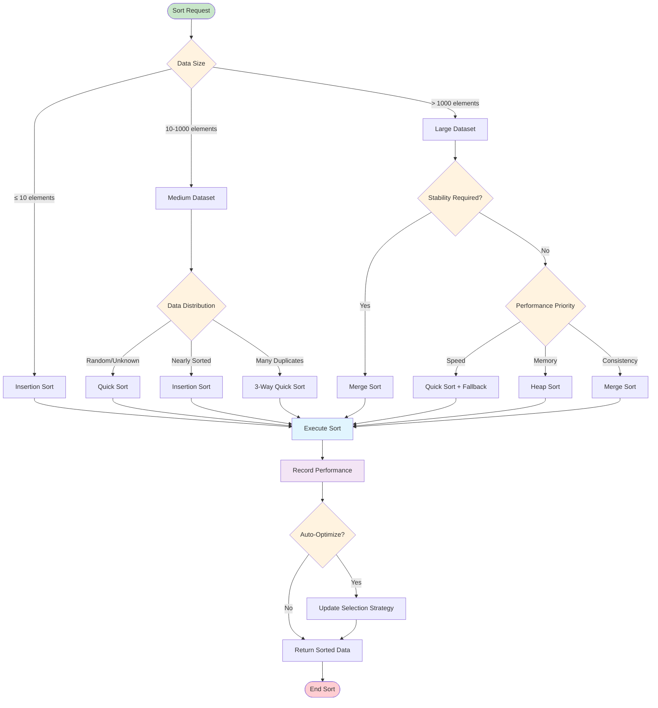
```mermaid
flowchart TD
    START([Sort Request]) --> SIZE{Data Size}
    
    SIZE -->|≤ 10 elements| INSERTION[Insertion Sort]
    SIZE -->|10-1000 elements| MEDIUM[Medium Dataset]
    SIZE -->|> 1000 elements| LARGE[Large Dataset]
    
    MEDIUM --> DISTRIBUTION{Data Distribution}
    DISTRIBUTION -->|Random/Unknown| QUICK[Quick Sort]
    DISTRIBUTION -->|Nearly Sorted| INSERTION_MED[Insertion Sort]
    DISTRIBUTION -->|Many Duplicates| QUICK_3WAY[3-Way Quick Sort]
    
    LARGE --> STABILITY{Stability Required?}
    STABILITY -->|Yes| MERGE[Merge Sort]
    STABILITY -->|No| PERFORMANCE{Performance Priority}
    
    PERFORMANCE -->|Speed| QUICK_LARGE[Quick Sort + Fallback]
    PERFORMANCE -->|Memory| HEAP[Heap Sort]
    PERFORMANCE -->|Consistency| MERGE_LARGE[Merge Sort]
    
    INSERTION --> EXECUTE[Execute Sort]
    QUICK --> EXECUTE
    INSERTION_MED --> EXECUTE
    QUICK_3WAY --> EXECUTE
    MERGE --> EXECUTE
    QUICK_LARGE --> EXECUTE
    HEAP --> EXECUTE
    MERGE_LARGE --> EXECUTE
    
    EXECUTE --> BENCHMARK[Record Performance]
    BENCHMARK --> OPTIMIZE{Auto-Optimize?}
    
    OPTIMIZE -->|Yes| UPDATE_STRATEGY[Update Selection Strategy]
    OPTIMIZE -->|No| RETURN[Return Sorted Data]
    
    UPDATE_STRATEGY --> RETURN
    RETURN --> END([End Sort])
    
    style START fill:#c8e6c9
    style END fill:#ffcdd2
    style SIZE fill:#fff3e0
    style DISTRIBUTION fill:#fff3e0
    style STABILITY fill:#fff3e0
    style PERFORMANCE fill:#fff3e0
    style OPTIMIZE fill:#fff3e0
    style EXECUTE fill:#e1f5fe
    style BENCHMARK fill:#f3e5f5
```

---

## State Diagrams

### Member Lifecycle State

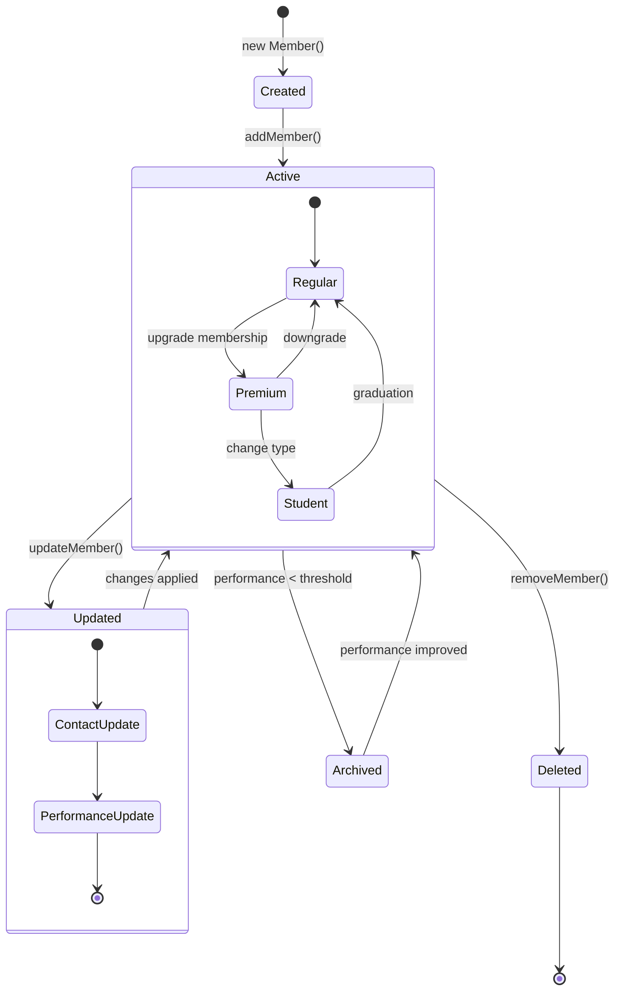
```mermaid
stateDiagram-v2
    [*] --> Created : new Member()
    Created --> Active : addMember()
    Active --> Updated : updateMember()
    Updated --> Active : changes applied
    Active --> Archived : performance < threshold
    Archived --> Active : performance improved
    Active --> Deleted : removeMember()
    Deleted --> [*]
    
    state Active {
        [*] --> Regular
        Regular --> Premium : upgrade membership
        Premium --> Student : change type
        Student --> Regular : graduation
        Premium --> Regular : downgrade
    }
    
    state Updated {
        [*] --> ContactUpdate
        ContactUpdate --> PerformanceUpdate
        PerformanceUpdate --> [*]
    }
```

### Search Index State

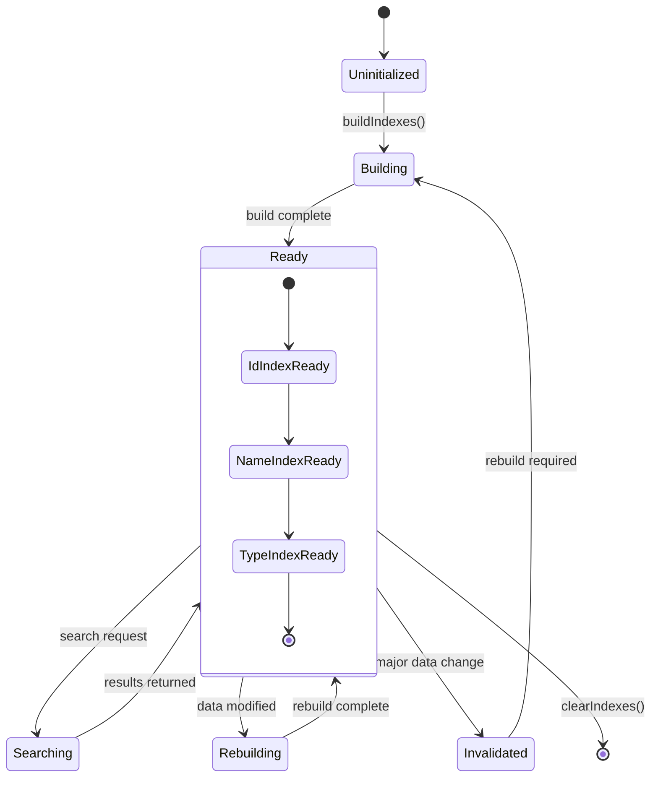
```mermaid
stateDiagram-v2
    [*] --> Uninitialized
    Uninitialized --> Building : buildIndexes()
    Building --> Ready : build complete
    Ready --> Searching : search request
    Searching --> Ready : results returned
    Ready --> Rebuilding : data modified
    Rebuilding --> Ready : rebuild complete
    Ready --> Invalidated : major data change
    Invalidated --> Building : rebuild required
    Ready --> [*] : clearIndexes()
    
    state Ready {
        [*] --> IdIndexReady
        IdIndexReady --> NameIndexReady
        NameIndexReady --> TypeIndexReady
        TypeIndexReady --> [*]
    }
```

---

## Entity Relationship Diagrams

### Member Data Relationships

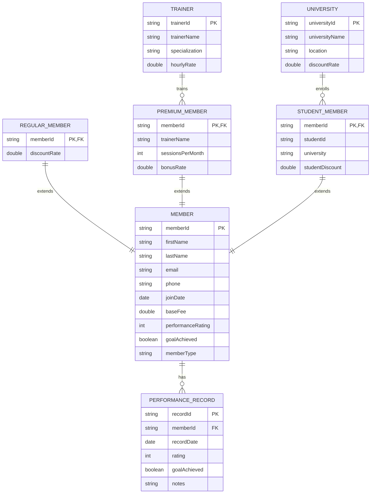
```mermaid
erDiagram
    MEMBER ||--o{ PERFORMANCE_RECORD : has
    MEMBER {
        string memberId PK
        string firstName
        string lastName
        string email
        string phone
        date joinDate
        double baseFee
        int performanceRating
        boolean goalAchieved
        string memberType
    }
    
    REGULAR_MEMBER ||--|| MEMBER : extends
    REGULAR_MEMBER {
        string memberId PK, FK
        double discountRate
    }
    
    PREMIUM_MEMBER ||--|| MEMBER : extends
    PREMIUM_MEMBER {
        string memberId PK, FK
        string trainerName
        int sessionsPerMonth
        double bonusRate
    }
    
    STUDENT_MEMBER ||--|| MEMBER : extends
    STUDENT_MEMBER {
        string memberId PK, FK
        string studentId
        string university
        double studentDiscount
    }
    
    PERFORMANCE_RECORD {
        string recordId PK
        string memberId FK
        date recordDate
        int rating
        boolean goalAchieved
        string notes
    }
    
    TRAINER ||--o{ PREMIUM_MEMBER : trains
    TRAINER {
        string trainerId PK
        string trainerName
        string specialization
        double hourlyRate
    }
    
    UNIVERSITY ||--o{ STUDENT_MEMBER : enrolls
    UNIVERSITY {
        string universityId PK
        string universityName
        string location
        double discountRate
    }
```

### System Component Relationships

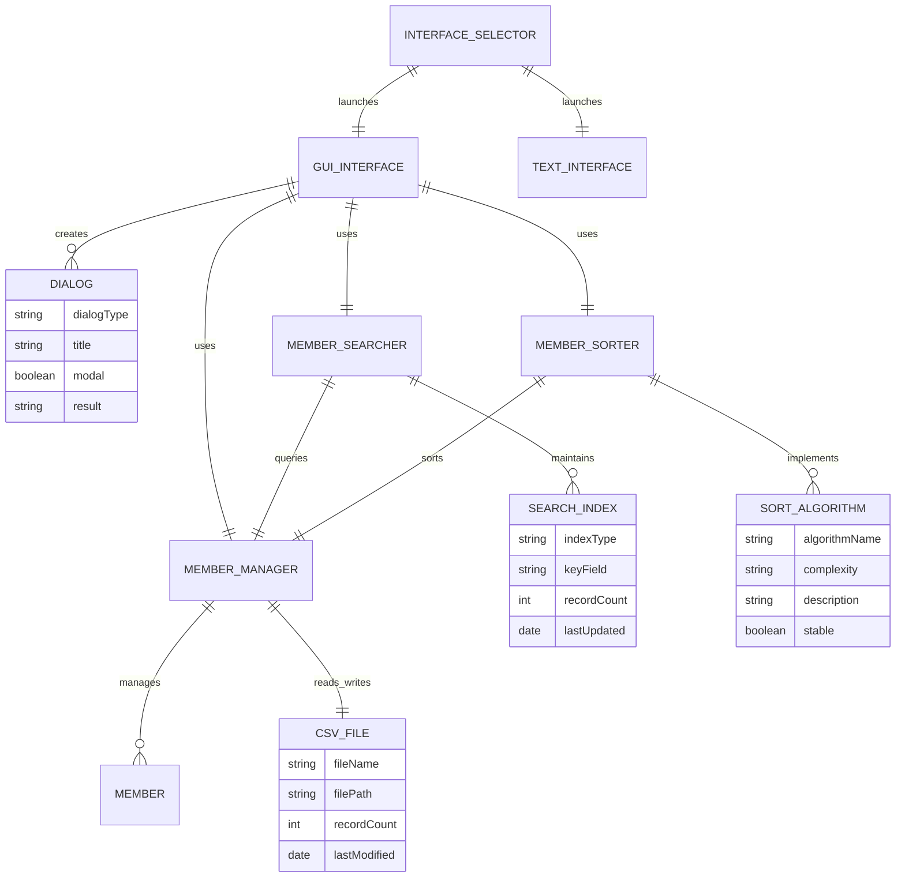
```mermaid
erDiagram
    INTERFACE_SELECTOR ||--|| GUI_INTERFACE : launches
    INTERFACE_SELECTOR ||--|| TEXT_INTERFACE : launches
    
    GUI_INTERFACE ||--o{ DIALOG : creates
    GUI_INTERFACE ||--|| MEMBER_MANAGER : uses
    GUI_INTERFACE ||--|| MEMBER_SEARCHER : uses
    GUI_INTERFACE ||--|| MEMBER_SORTER : uses
    
    DIALOG {
        string dialogType
        string title
        boolean modal
        string result
    }
    
    MEMBER_MANAGER ||--o{ MEMBER : manages
    MEMBER_MANAGER ||--|| CSV_FILE : reads_writes
    
    MEMBER_SEARCHER ||--|| MEMBER_MANAGER : queries
    MEMBER_SEARCHER ||--o{ SEARCH_INDEX : maintains
    
    MEMBER_SORTER ||--|| MEMBER_MANAGER : sorts
    MEMBER_SORTER ||--o{ SORT_ALGORITHM : implements
    
    SEARCH_INDEX {
        string indexType
        string keyField
        int recordCount
        date lastUpdated
    }
    
    SORT_ALGORITHM {
        string algorithmName
        string complexity
        string description
        boolean stable
    }
    
    CSV_FILE {
        string fileName
        string filePath
        int recordCount
        date lastModified
    }
```

---

## Performance Analysis Diagrams

### Algorithm Complexity Comparison

```mermaid
graph LR
    subgraph "Search Algorithms"
        LS[Linear Search<br/>O(n)]
        HS[Hash Search<br/>O(1)]
        BS[Binary Search<br/>O(log n)]
        AS[Advanced Search<br/>O(n×m)]
    end
    
    subgraph "Sort Algorithms"
        IS[Insertion Sort<br/>O(n²)]
        QS[Quick Sort<br/>O(n log n)]
        MS[Merge Sort<br/>O(n log n)]
        HS2[Heap Sort<br/>O(n log n)]
        CS[Counting Sort<br/>O(n+k)]
    end
    
    subgraph "Performance Classes"
        CONST[Constant O(1)]
        LOG[Logarithmic O(log n)]
        LINEAR[Linear O(n)]
        NLOGN[Linearithmic O(n log n)]
        QUAD[Quadratic O(n²)]
    end
    
    HS --> CONST
    BS --> LOG
    LS --> LINEAR
    AS --> LINEAR
    CS --> LINEAR
    QS --> NLOGN
    MS --> NLOGN
    HS2 --> NLOGN
    IS --> QUAD
    
    style CONST fill:#c8e6c9
    style LOG fill:#dcedc1
    style LINEAR fill:#fff3e0
    style NLOGN fill:#ffe0b2
    style QUAD fill:#ffcdd2
```

### Memory Usage Analysis

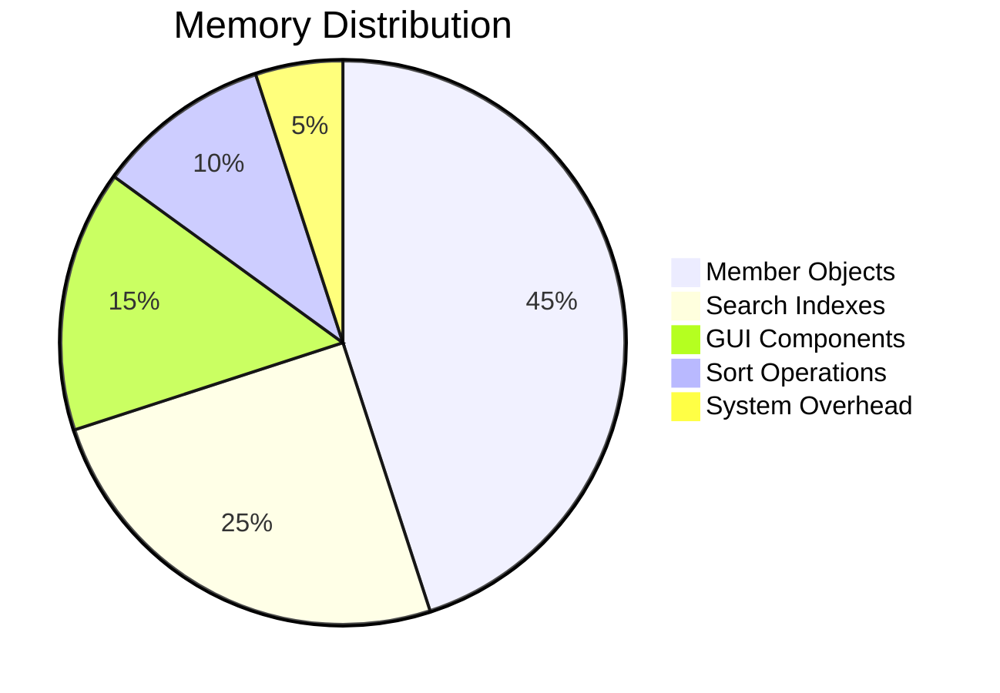
```mermaid
pie title Memory Distribution
    "Member Objects" : 45
    "Search Indexes" : 25
    "GUI Components" : 15
    "Sort Operations" : 10
    "System Overhead" : 5
```

---

*These Mermaid diagrams provide comprehensive visual documentation of the Member Management System architecture, supporting the technical analysis presented in the main report.*