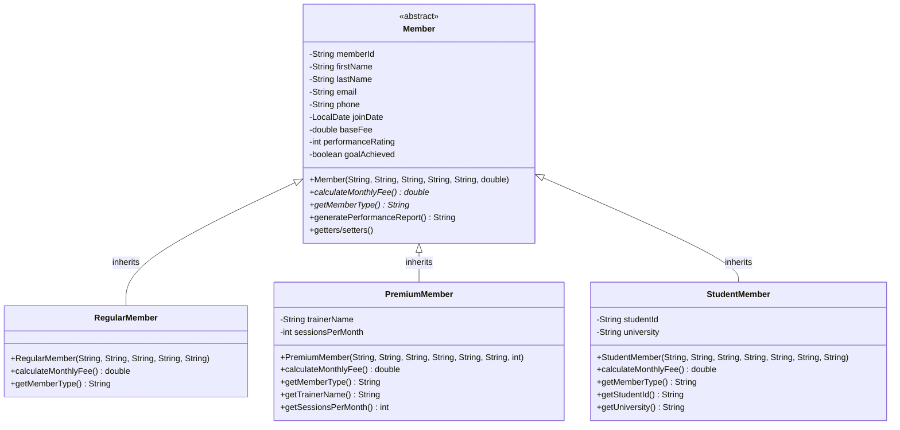
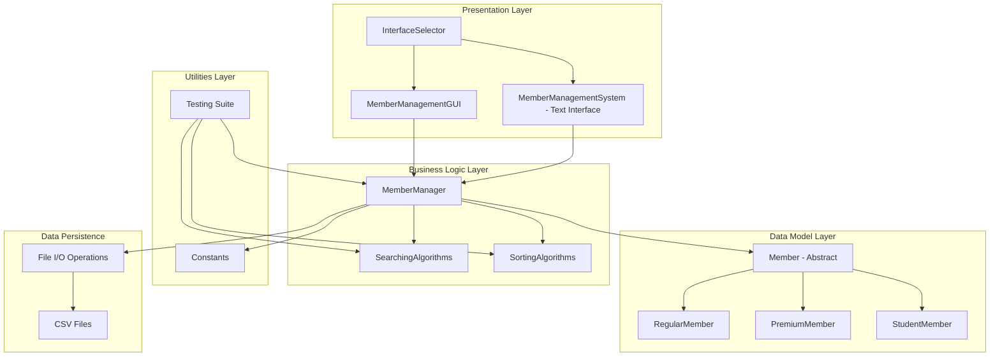
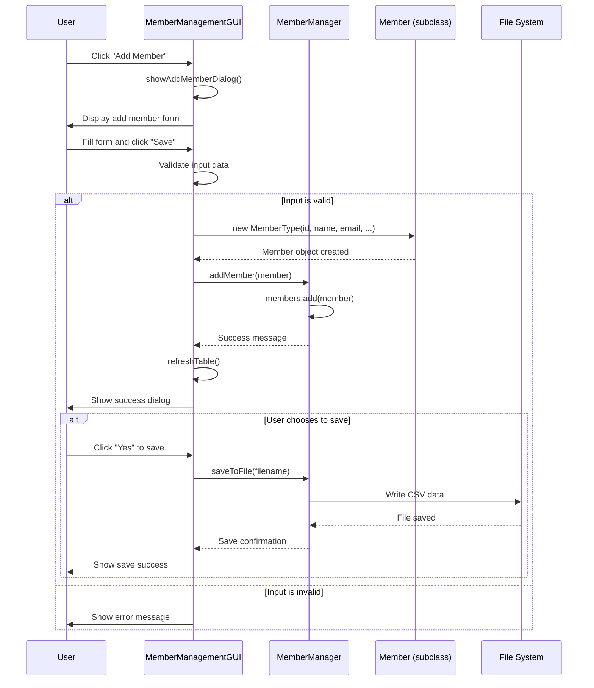
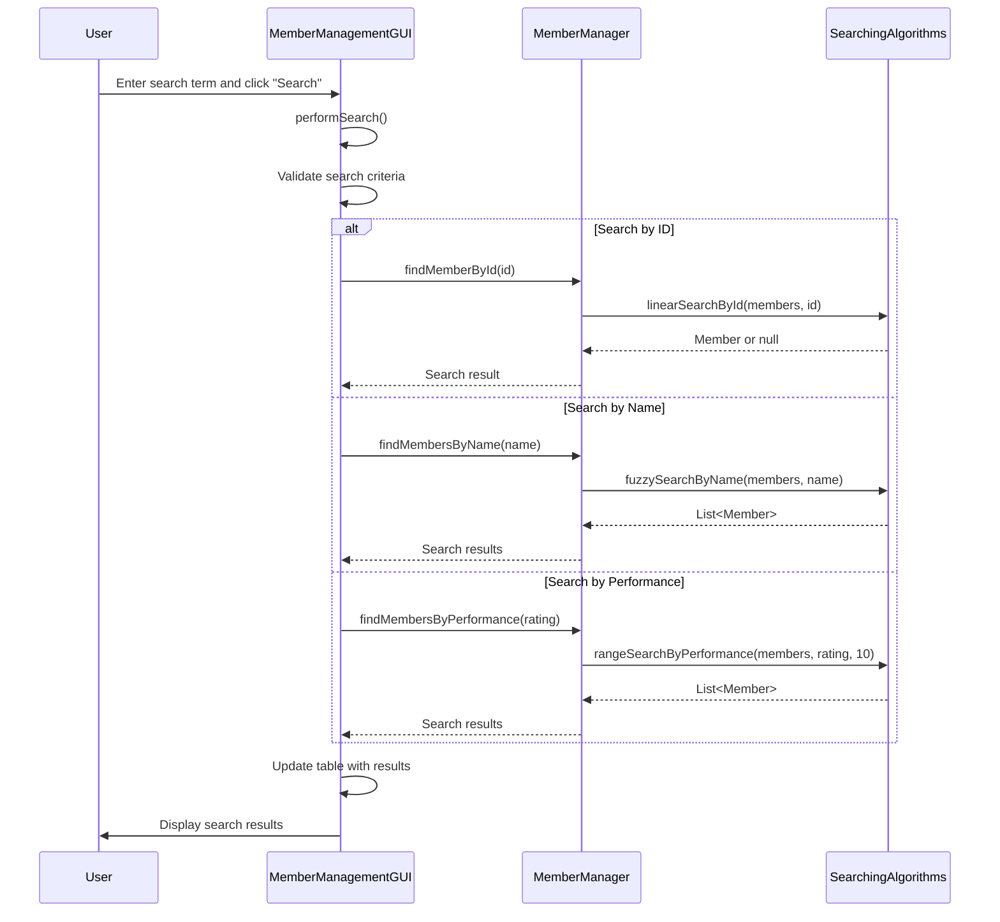
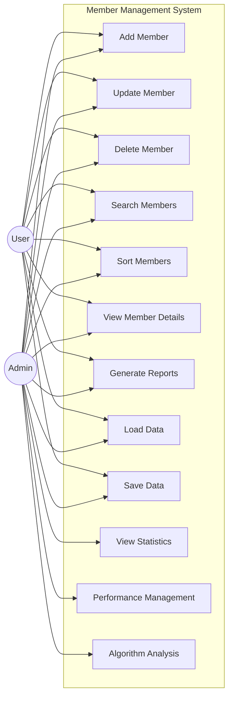
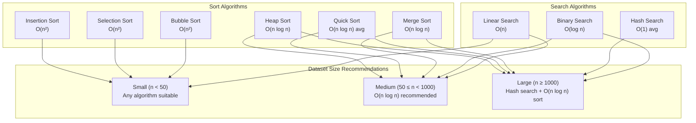
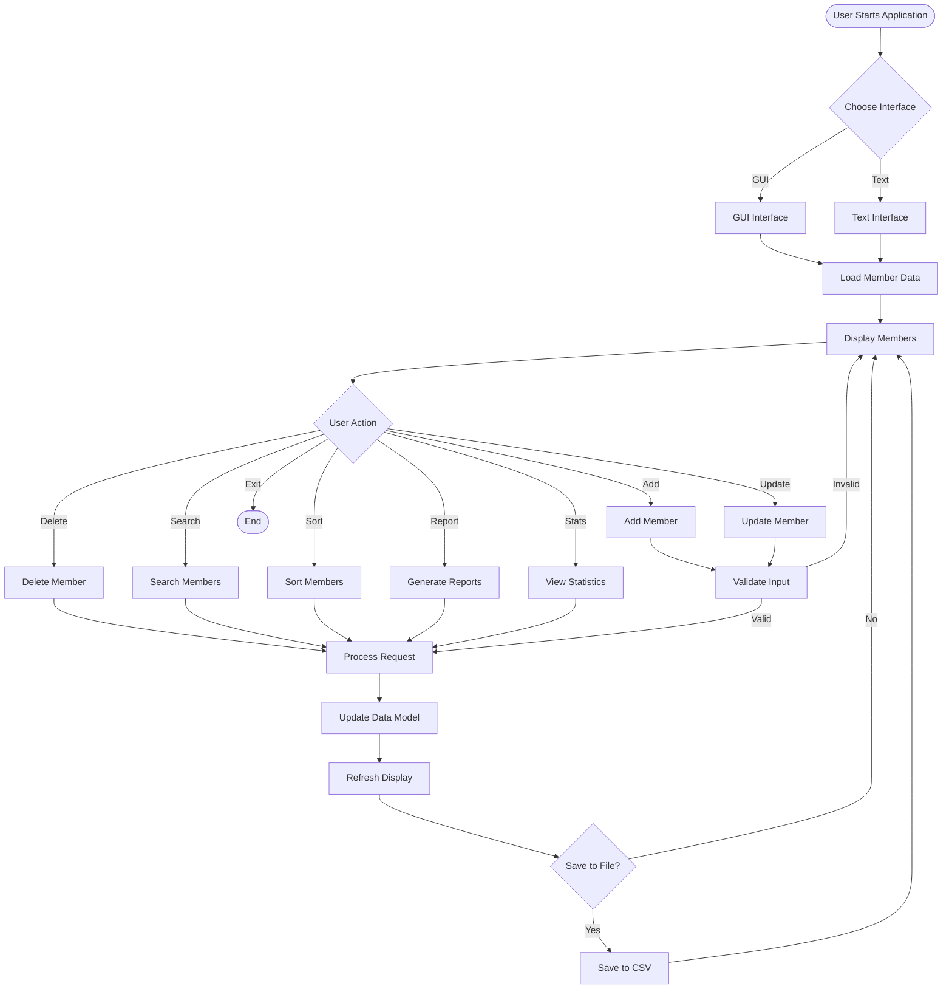
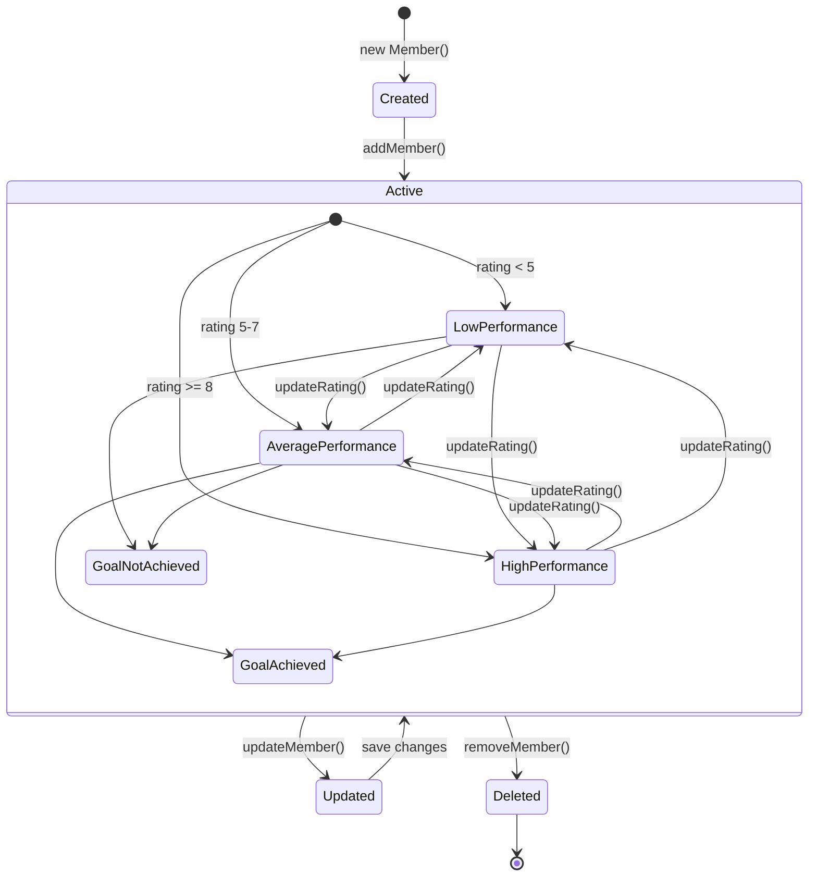

# Member Management System - UML and Architecture Diagrams

This document contains comprehensive UML and architecture diagrams for the ICT711 Member Management System project.

## 1. Class Hierarchy Diagram



## 2. System Architecture Diagram



## 3. Sequence Diagram - Add New Member (GUI)



## 4. Sequence Diagram - Search Operations



## 5. Component Diagram

```mermaid
graph LR
    subgraph "UI Components"
        C1[Interface Selector]
        C2[GUI Interface]
        C3[Text Interface]
    end
    
    subgraph "Core Components"
        C4[Member Manager]
        C5[Algorithm Components]
    end
    
    subgraph "Data Components"
        C6[Member Models]
        C7[Constants]
        C8[File Handler]
    end
    
    subgraph "Testing Components"
        C9[Test Suite]
        C10[Performance Tests]
    end
    
    C1 ..> C2 : creates
    C1 ..> C3 : creates
    C2 --> C4 : uses
    C3 --> C4 : uses
    C4 --> C5 : uses
    C4 --> C6 : manages
    C4 --> C7 : references
    C4 --> C8 : uses
    C9 --> C4 : tests
    C9 --> C5 : tests
    C10 --> C5 : measures
```

## 6. Use Case Diagram



## 7. Algorithm Complexity Diagram



## 8. Data Flow Diagram



## 9. Deployment Diagram

```mermaid
graph TB
    subgraph "Development Environment"
        DE1[Java Development Kit 11+]
        DE2[IDE (Eclipse/IntelliJ/VS Code)]
        DE3[Source Code Files]
    end
    
    subgraph "Runtime Environment"
        RE1[Java Runtime Environment]
        RE2[Member Management System JAR]
        RE3[CSV Data Files]
        RE4[Configuration Files]
    end
    
    subgraph "User Interface Options"
        UI1[Swing GUI Application]
        UI2[Console Text Application]
    end
    
    DE1 --> RE1 : deploys to
    DE2 --> RE2 : builds
    DE3 --> RE2 : compiled into
    
    RE1 --> UI1 : runs
    RE1 --> UI2 : runs
    RE2 --> RE3 : reads/writes
    RE2 --> RE4 : uses
```

## 10. State Diagram - Member Lifecycle



## Summary

These diagrams provide a comprehensive view of the Member Management System architecture and design:

1. **Class Hierarchy** - Shows inheritance relationships and polymorphism
2. **System Architecture** - Illustrates layered architecture and component separation
3. **Sequence Diagrams** - Detail interaction flows for key operations
4. **Component Diagram** - Shows system components and their relationships
5. **Use Case Diagram** - Identifies system functionality and user interactions
6. **Algorithm Complexity** - Visualizes performance characteristics
7. **Data Flow** - Shows how data moves through the system
8. **Deployment** - Illustrates system deployment structure
9. **State Diagram** - Shows member lifecycle states

The system demonstrates good object-oriented design principles, separation of concerns, and scalable architecture suitable for educational purposes and real-world application.